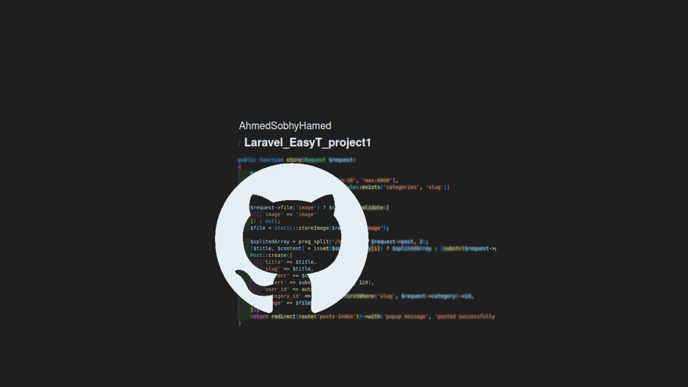
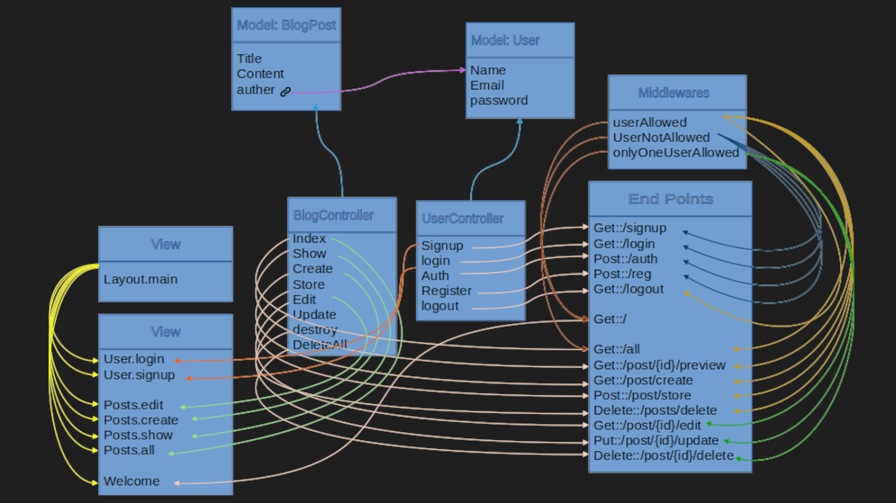

# Laravel_EasyT_project2

A small blog system, with post CRUD system, viewing users posts, create your own and manage your posts.



## Table of Contents

-   [Introduction](#introduction)
-   [Features](#features)
-   [Installation](#installation)
-   [Usage](#usage)
-   [Technologies Used](#technologies-used)
-   [Project Structure](#project-structure)
-   [License](#license)
-   [Contact](#contact)

  <!-- intro -->

## Introduction

This project is just for practice while I am learning Laravel.
<br>
with HTML plane view, I created a blog system with a resourceful post CRUD system to create ,update , view and delete posts. with welcome page that change the content depend on authentication for the user, there is login and sign up forms, or the blog links to create or view posts.
<br>
you can see all posts and the post that you craeted will shadowed.
<br>
and with middlewares i restrect the edit or delete your own posts only.
<br>
and with middlewares i redirct guests to welcome pages

  <!-- technologies was used with links if available -->

## Features

    ```diff
        Using MVC architecture.
        Using Laravel Authentication system.
        Validating users data.
        Using ORM Laravel eloquent models.
        Create resourceful controller.
        Create CRUD system.
        Using yield-section blade approach.
        Create middleware.
        Seeding with fake data for testing.
    ```

  <!-- get start and how to run with the prerequisites mintion -->

## Installation

1. install pre-requisies utilities

    - install php
      on Ubuntu, Debian, and Linux Mint:

        ```sh
        sudo apt-get install php8.1 php8.1-cli php8.1-common php8.1-curl php8.1-mysql
        ```

    - install mysql
      on Ubuntu, Debian, and Linux Mint:

        ```sh
        sudo apt-get install mysql-client-8.0 mysql-client-core-8.0 mysql-server-core-8.0
        ```

    - install composer
      on Ubuntu, Debian, and Linux Mint:

        ```sh
        sudo apt-get install composer
        ```

    - install npm
      on Ubuntu, Debian, and Linux Mint:

        ```sh
        sudo apt-get install nodejs npm
        ```

2. Clone the repository:

    ```sh
    git clone https://github.com/AhmedSobhyHamed/Laravel_EasyT_project2.git
    ```

3. Navigate to the project directory:

    ```sh
    cd work_directory
    ```

4. Install dependencies:

    - laravel dependencies

        ```sh
        compose install
        ```

    - node dependencies

        ```sh
        npm install
        ```

5. Set up environment variables:

    ```sh
    cp .env.example .env
    ```

6. Link storage to public folder:

    ```sh
    php artisan storage:link
    ```

7. Create Database and User:

    - open mysql

        ```sh
        sudo mysql
        ```

    - create database

        ```sh
        CREATE DATABASE easyt-database-2;
        ```

    - create user

        ```sh
        CREATE USER IF NOT EXISTS
        'easytUser'@'localhost' IDENTIFIED WITH caching_sha2_password BY 'password'
        REQUIRE NONE
        WITH MAX_CONNECTIONS_PER_HOUR 1800 MAX_USER_CONNECTIONS 5
        PASSWORD EXPIRE NEVER FAILED_LOGIN_ATTEMPTS 5 PASSWORD REQUIRE CURRENT PASSWORD_LOCK_TIME 1;
        ```

    - grant privilages

        ```sh
        GRANT INSERT,UPDATE,DELETE,SELECT,CREATE,DROP,ALTER,REFERENCES ON `easyt-database-2`.* TO 'easytUser'@'localhost';
        FLUSH PRIVILEGES;
        ```

8. Migrate tables:

    ```sh
    php artisan migrate
    ```

9. Adding fake data for testing purpose (optional):

    - open tinker

        ```sh
        php artisan tinker
        ```

    - faking data and use seed

        ```sh
        php artisan DB:seed --class=BlogPostSeeder
        ```

10. Start the application:

    ```sh
    php artisan serve
    ```

    Then open the browser to the link typed in the terminal.

  <!-- usage or how to interact with this technologies like api end points and what they do -->

## Usage

<!-- **You can interact with the project via this link**
[web page on github](https://ahmedsobhyhamed.github.io/Laravel_EasyT_project2/).
<br> -->

**[see an example for user interaction.[video]](http://youtube.com)**

#### Interacting with endpoints in the browser:

1. Register for an account or log in with existing credentials

    ```diff
    http://localhost:8000/login
    http://localhost:8000/signup
    ```

2. View all posts to which you have access.

    ```diff
    http://localhost:8000/all
    ```

3. View a specific post with its comments and reactions.

    ```diff
    http://localhost:8000/post/{id}/preview
    ```

4. Go to the 'create new post' page.

    ```diff
    http://localhost:8000/post/create
    ```

5. Go to the 'edit post' page.
    ```diff
    http://localhost:8000/post/{id}/edit
    ```

## Technologies Used

-   languages:

    -   PHP
    -   mysql
    -   HTML 5.

-   framworks:

    -   Laravel

      <!-- about the project and a digram of how it work -->

## Project Structure



  <!-- licance -->

## License

This project is licensed under the MIT License - see the [LICENSE](/LICENSE) file for details

  <!-- contacts -->

## Contact

Created by [Ahmed Sobhy]:

-   email: [ahmed.s.abdulaal@gmail.com](mailto:ahmed.s.abdulaal@gmail.com)
-   linkedin: [Ahmed Sobhy](https://www.linkedin.com/in/ahmed-sobhy-b824b7201/)
    <br>
    feel free to contact me!
